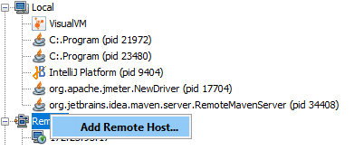
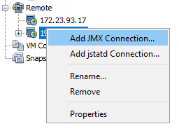
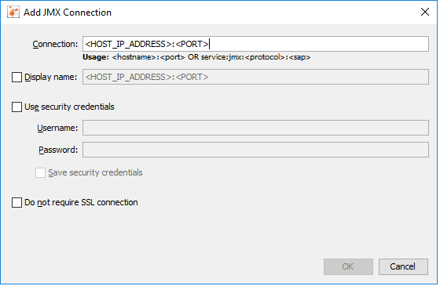

### Profile Java Web application in tomcat 7
cd <BASE_TOMCAT_FOLDER>
$ vim bin/setenv.sh

Add props to the end of CATALINA_OPTS

-Dcom.sun.management.jmxremote -Dcom.sun.management.jmxremote.port=<PORT> -Dcom.sun.management.jmxremote.ssl=false -Dcom.sun.management.jmxremote.authenticate=false -Djava.rmi.server.hostname=<HOST_IP_ADDRESS>

## Follow tomcat docs for more information
https://tomcat.apache.org/tomcat-7.0-doc/monitoring.html 

## Connect remotely through VisualVM

